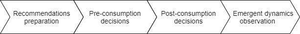
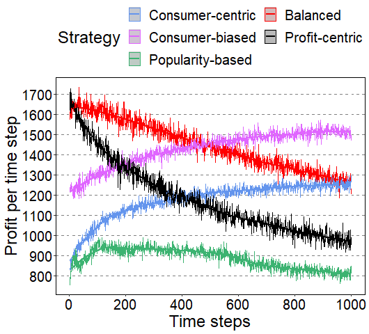
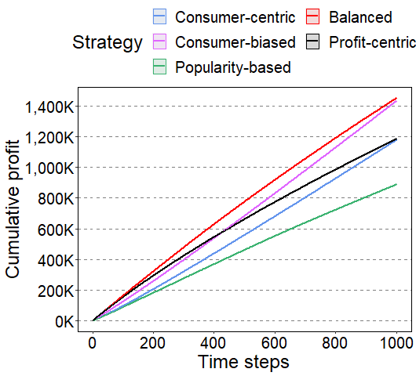

## Table of content

- [Table of content](#table-of-content)
- [Summary](#summary)
- [General model workflow](#general-model-workflow)
- [Requirements](#requirements)
- [Installation](#installation)
  - [Local installation](#local-installation)
  - [Remote installtion](#remote-installtion)
- [Running the model](#running-the-model)
- [File structure](#file-structure)
- [Dataset to compute consumers items' utilities](#dataset-to-compute-consumers-items-utilities)
- [Configuration file](#configuration-file)
- [Results](#results)


## Summary
This agent-based model demonstrates the consequences of various recommendation strategies in a multistakeholder platform. Focusing only to satisfy consumers in delivering the recommendations affects other stakeholders' interests, such as the service provider.
Similarly, Delivering the recommendations to maximize the profit affects consumers' trust in the service provider.
We are interested in understanding this phenomenon deeply and its long-term effects on consumers' trust in the recommendation service provider and the profit gained by the provider when a specific strategy is applied.
The model integrates various consumers decisions and experiences sharing via naive social media space.
Two types of agents are used in this model: 

<ul>
<li> Recommendation service provider: Prepares and sends personalized recommendations to the consumers </li>
<li> Consumer: Receives the recommendations and make further decisions </li>
</ul>

## General model workflow


## Requirements
We tested the code on a local machine wit Windows 10, Python=3.7, 16GB, and core i7. 
The code also was tested on a remote machine with docker, Ubuntu 20.04.2 LTS x86_64, Python docker image, 30GB, and Intel Xeon E5645 (12) @ 2.4. \
Fot local installation on Windows, it is recommended to install Anaconda last version, which comes with Python 3 and supports scientific packages installation.

The following packages are used in our model, and they are already included in the `requirments.txt`:
* [numpy](https://numpy.org/)
* [matplotlib](https://matplotlib.org/)
* [pandas](https://pandas.pydata.org/)
* [scipy](https://www.scipy.org/)
* [surprise](http://surpriselib.com/)
* [mesa](https://mesa.readthedocs.io/en/master/tutorials/intro_tutorial.html)
* [pyyaml](https://pyyaml.org/)

## Installation
The installation is possible on a local or remote machine. We assume the remote machine has a docker installed. If not docker, you can follow the instructions of local installation.
### Local installation
Download and install [AnaConda](https://www.anaconda.com/products/individual-d) (Indevedual Edition)

Create a virtual environment
```
conda create -n myenv python=3.6
```
Activate the virtual environment 
```
conda activate myenv
```
More commands on using virtual environment in Anaconda is available [here](https://docs.conda.io/projects/conda/en/latest/user-guide/tasks/manage-environments.html) 
Install the required packages by running: 
```
pip install -r requirements.txt
```

If you face errors in insatlling **surprise** package on Windows, run:
```
conda install -c conda-forge scikit-surprise
```
### Remote installtion 
We provide a docker image on Docker hub, to pull the image use the following:

```
docker pull nadadocker/simulation
```

## Running the model
To run the simulation locally, change directory to src, and run: 
```python run.py```
OR 
Since the simulation generates data at the end, docker volume captures the data from a directory in the running container to the host.
The following command runs a new container of the simulation and stores the output in the "results" directory. Before running a docker container, we should create `results` directory in the host machine by executing the following commands: 


```git clone https://github.com/nadaa/simulation.git```

```cd simulation```

```mkdir results```

Create a new docker container to run the simulation

```docker run -dit --rm -v ${PWD}/results:/results --name <my_container> <nadadocker/simulation>```

* `container_name`: A name of the container
* `${PWD}`: The current working directory
* `-v ${PWD}/results:/results`: Sets up a bindmount volume that links the `/results` directory from inside the 'container_name' to the  directory ${PWD}/results on the host machine. Docker uses a : to split the host’s path from the container path, and the host path always comes first
* `<nadadocker/simulation>` : The docker image that is used to run the container


## File structure
The simulation is built in [Mesa](https://github.com/projectmesa/mesa), an agent-based simulation framework in Python.


├── data/
│   ├── dataset                 <- MovieLens dataset 
│   │   ├── movies.csv
│   │   └── ratings.csv
│   ├── recdata/                  <- Recommendation algorithm output saved in a pickle format
│   │   ├── consumers_items_utilities_predictions.p
│   │   ├── consumers_items_utilities_predictions_popular.p
│   │   └── SVDmodel.p
│   └── trust/                    <- Initial data for consumers trust 
│       └── beta_initials.p
├── Dockerfile
├── figures/                      <- Figures that show model results
│   ├── modelgeneralflow.png
│   ├── time-consumption_probability.png
│   ├── time-total_profit.png
│   └── time-trust.png
├── README.md
├── requirements.txt
├── results/                      <- Store model results
├── src/
  ├── __init__.py
  ├── config.yml                  <- Model settings
  ├── consumer.py                 <- Contains all propoerties and behaviors of consumer agent 
  ├── mesa_utils/
  │   ├── __init__.py
  │   ├── datacollection.py
  │   └── schedule.py
  ├── model.py                    <- Contains the model class, which manages agents creation, data sharing, and model output collection 
  ├── plots.py                    <- Ploting module for data analysis
  ├── read_config.py
  ├── run.py                      <- Launchs the simulation
  ├── service_provider.py         <- Contains all properties and behaviors of Service provider agent
  ├── test.py
  └── utils.py             <- An auxiliary module for extra helpful functions


## Dataset to compute consumers items' utilities
We used [Movielens dataset](https://grouplens.org/datasets/movielens/), the small version (1 MB), which contains movie ratings for multiple users, [more details](http://files.grouplens.org/datasets/movielens/ml-latest-small-README.html). The following shows the content of `ratings.csv`.


|userId|movieId|rating|timestamp|
|------|-------|------|---------|
|1|	1|4|964982703|
|1|3|4|964981247|
|1|6|4|964982224|
|1|47|5|964983815|
|1|50|5|964982931|

The dataset is used to predict consumer items utilities, and to initialize the model.

## Configuration file
Before running the simulation, make sure you set up desired values for model parameters in the `config.yml`. The configuration file is in [yaml](https://de.wikipedia.org/wiki/YAML) format. The file includes all required parameters to set up the model.


**Note**: Running the code may take a long time based on the predefined time steps and number of replications in the configuration. 


## Results
Each execution of the model generates a unique folder inside the results folder. The collected data from the simulation contains various CSV files, scenarios.json, and png plots.


The following is part of the results generated from running the simulation for 1000 time steps and three replications. The simulation comprises one service provider agent and 610 consumer agents, and consumers can share their experiences on social media.


<table>
  <tr>
    <td>Consumption probability</td>
     <td>Profit per step</td>
     <td>Cumulative profit</td>
  </tr>
  <tr>
    <td></td>
    <td></td>
    <td></td>
  </tr>
 </table>

